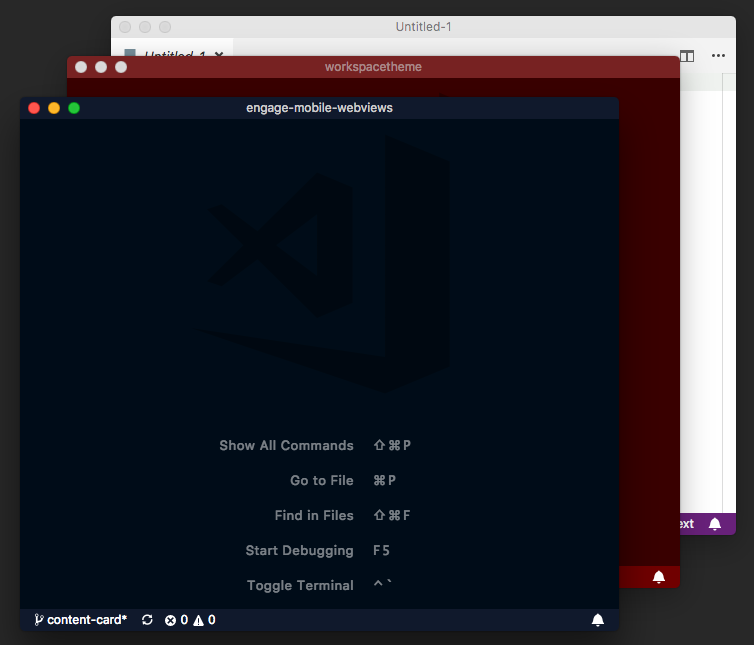

# Workspace Theme

This extension lets you set a theme per workspace. This is a nice way to distinguish different workspaces you may have open at the same time.

## Features

- Lets you easily select a theme
- Allows to return to the default theme
- Preview the new theme while selecting

## Usage

Use Command+Shift+P and select "Set Workspace Theme". Then select a theme to apply to the current workspace only. To go back to the default, select the "Restore Default Theme" option.

Instead of the command palette, you can also invoke the dialog with the keyboard shortcut "Cmd+K Cmd+Shift+T".

## Known Issues

For some reason, only themes installed as extensions seem to work.

## Release Notes

### 1.1.0

Added preview feature when selecting workspace themes

### 1.0.1

Added example image

### 1.0.0

Initial release.
